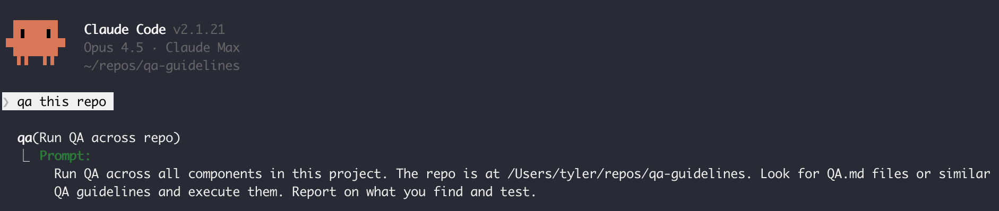
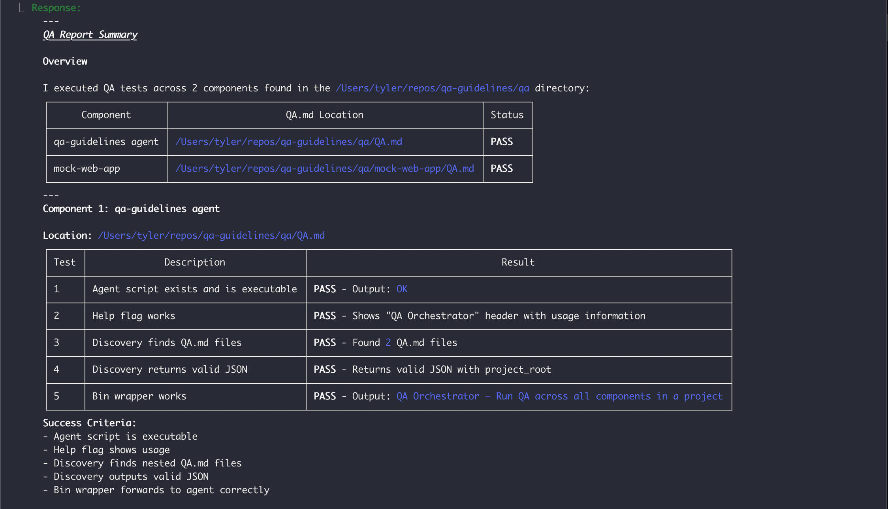

<div align="center">
  
  <h1>QA Guidelines</h1>
</div>

A sanity-forward alternative or complement to traditional tests for AI generated code.

QA guidelines aim to mimic how a human manually tests software, whether that be for a web app, an SDK, or your favorite tools. It's quick and easy to set up (and iterate upon) yet effective at catching regressions.

---



---

### The QA.md file

To test a module in your project, add a `QA.md` to define your *QA Guidelines*.

QA Guidelines consist of...

1. Requirements (dependencies, tooling, environment)
2. Setup instructions
3. QA Steps
4. Success Criteria
5. Cleanup (optional)

### The QA Agent


The QA agent finds modules with QA guideline files, performs quality assurance for any module with a guidelines file in parallel, which all gets combined, finally amalgamating in a pass/fail report that breaks down what the agent "saw" and its analysis on whether or not the success criteria was met.

#### QA Reports

After running, the agent generates a timestamped markdown report in `.reports/` showing pass/fail status for each module, checkpoint details, any errors encountered, and a high-level analysis of whether the success criteria was met.



## Requirements

- `node` (v18+)
- `jq`
- `git` (for branch/commit info in reports)
- `ANTHROPIC_API_KEY` environment variable

## Installation

To install the QA agent for your project:

```bash
# for a project
npm install -g qa-guidelines

# globally (recommended)
npx qa-guidelines install
```

## Usage

```bash
qa ./path/to/project
```

The agent searches the directory (and all nested directories) for `QA.md` files, runs each one in parallel, and generates a report.

Or without installing:

```bash
npx qa ./path/to/qa-guidelines
```

## Writing `QA.md` Files

Every module, service, or application should have a `QA.md` file at its root that defines how to verify it works correctly. This file is the single source of truth for setup, test steps, and success criteria.

A `QA.md` file has four required sections: requirements, setup, QA steps, and success criteria.

```markdown
# QA: mock-web-app

A todo list web app with an HTML frontend and JSON API. Zero dependencies — just Node.

## Requirements

- `node` (v18+)
- Playwright MCP server

## Setup

1. Start the server: `node qa/mock-web-app/server.js &`
2. Wait for "Todo app listening" message

## Test Steps

Use the Playwright MCP server to perform all browser interactions and API calls.

### 1. Server starts and responds

Navigate to http://localhost:9876/health

**Expected:** Page loads successfully with JSON containing `"status": "ok"`

### 2. Homepage serves HTML

Navigate to http://localhost:9876/

**Expected:** Page title is "Todo App"

### 3. Homepage has a form

On the homepage, look for the add todo form.

**Expected:** Form with id "add-form" is visible

### 4. Todo list starts empty

Check that no todos are displayed initially.

**Expected:** Todo list is empty

### 5. Create a todo

Use the form to add a todo with title "Buy milk".

**Expected:** Todo "Buy milk" appears in the list

### 6. Toggle todo done

Click the toggle/checkbox button on the "Buy milk" todo to mark it as done.

**Expected:** Todo shows as completed/done

### 7. Delete todo

Click the delete button on the "Buy milk" todo.

**Expected:** Todo is removed from the list

### 8. List is empty after delete

Verify the todo list is empty again.

**Expected:** No todos displayed

### 9. Invalid create returns error

Try to submit the form with an empty title.

**Expected:** Error message or validation prevents submission

### 10. Not found handling

Navigate to http://localhost:9876/api/todos/999

**Expected:** 404 response or "Not found" message

## Cleanup

```bash
kill $(lsof -ti:9876) 2>/dev/null || true
```

## Success Criteria

- [ ] Server starts and health check responds
- [ ] Homepage serves HTML with form
- [ ] CRUD operations work (create, read, toggle, delete)
- [ ] Validation returns error for missing title
- [ ] Missing resources return 404
```

## Test Fixtures and Mocks

Some modules can't be QA'd against real dependencies — the external service might be unavailable, rate-limited, or stateful in ways that make tests unreliable. In these cases, write a lightweight mock that your QA steps run against instead.

### When to use mocks

- **External APIs** — third-party services you don't control
- **Databases with seed data** — when tests need a known starting state
- **Self-testing** — verifying a test framework against a known-good target (see `qa/mock-web-app/` in this repo, which exists so the QA agent can test itself)

```
my-module/
├── QA.md
├── mocks/
│   └── mock-api/
│       └── server.js
└── src/
```

Then reference the mock in your QA.md Setup or Test Steps:

```markdown
## Setup

1. Start the mock API: `node mocks/mock-api/server.js &`
2. Start the module: `API_URL=http://localhost:9999 npm start &`
```

> If your mock starts a process, add a Cleanup section to kill it:

## Configuration

### Ignoring Directories

Create a `.qaignore` file in your project root to skip directories during discovery:

```
node_modules
dist
vendor
```

### Tool Permissions

Add a `<!-- tools: Bash,Read -->` comment to your `QA.md` to control which tools Claude can use. Defaults to `Bash,Read`.

## How It Works

### 1. QA.md Files

Each module gets a `QA.md` file at its root that acts as an executable spec:

- **Requirements** — tools and environment variables needed
- **Setup** — how to install and start the module
- **Test Steps** — numbered steps, each explaining how to verify a piece of the system
- **Success Criteria** — what must pass for QA to succeed

### 2. QA Agent

An orchestrator that:

1. **Discovers** all modules with QA.md files across the project
2. **Runs** each QA in parallel (using the Claude Agent SDK to run an agent per module)
3. **Aggregates** results into pass/fail per module
4. **Generates** timestamped markdown reports

### Why It Works

- Module authors verify their own QA steps work (deterministically, once)
- The agent handles the tedium of re-running those steps later
- Reports track QA state over time by branch and timestamp

## Examples

See the [examples/](examples/) directory for simple examples of QA Guidelines in action.
